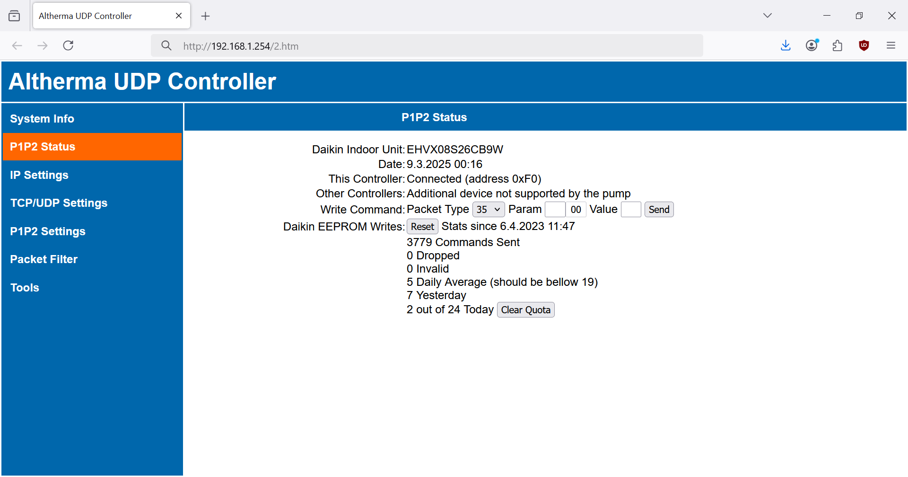
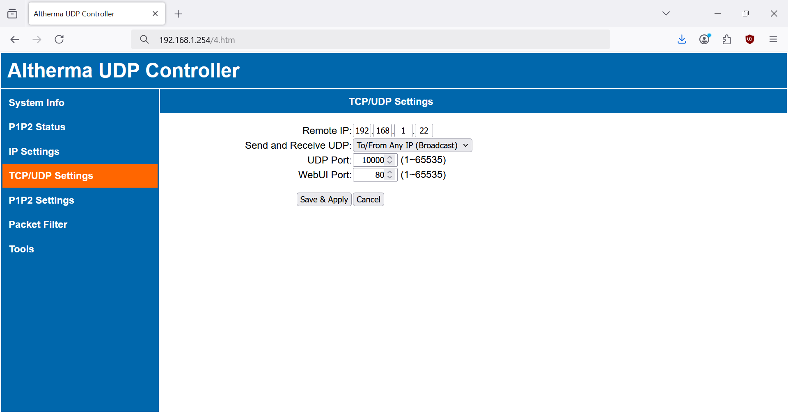

# Arduino Altherma UDP Controller

## What is it good for?

Allows you to connect your Daikin Altherma heat pump (P1/P2 bus) to a home automation system (such as Loxone). This controller reads data from the P1/P2 bus on your Daikin Altherma and forwards them via ethernet UDP. You can also control your Daikin Altherma by sending commands via ethernet UDP.

The controller itself can be configured through built-in web interface, which alsoallows you to monitor the P1/P2 connection and count errors. All settings and P1/P2 statistics are stored in EEPROM. This program implements P1P2Serial library (https://github.com/Arnold-n/P1P2Serial).

## What are the technical specifications?

* this controller is compatible with Daikin Altherma heat pumps (E-series), including:
  - Altherma Hybrid
  - Altherma
  - Altherma 3
* connects to Daikin Altherma via P1/P2 interface
* connects to home automation system via local ethernet
* communication protocol:
  - UDP (raw HEX data)
* diagnostics via built-in web interface:
  - send P1/P2 command directly via web interface
  - P1/P2 statistics, counters for packets read from and written to P1/P2, counters for errors (counters are saved to EEPROM every 6 hours)
  - rollover of counters is synchronized
  - content of the P1P2 Status page is updated in the background (fetch API), javascript alert is shown if connection is lost
* user settings:
  - can be changed via web interface (see screenshots bellow)
  - stored in EEPROM
  - retained during firmware upgrade (only in case of major version change, Arduino loads factory defaults)
  - all web interface inputs have proper validation
  - factory defaults for user settings can be specified in advanced_settings.h
  - settings marked \* are only available if ENABLE_DHCP is defined in the sketch
  - settings marked \*\* are only available if ENABLE_EXTRA_DIAG is defined in the sketch
* advanced settings:
  - can be changed in sketch (advanced_settings.h)
  - stored in flash memory

# Hardware
Get the hardware and connect together:

* **Arduino Uno or Mega**.

* **Ethernet shield (with W5100, W5200 or W5500 chip)**. The ubiquitous W5100 shield for Uno/Mega is sufficient. !!! ENC28J60 will not work !!!
* **Custom P1P2 Uno adapter**. You can [solder your own adapter](https://github.com/Arnold-n/P1P2Serial/tree/main/circuits#p1p2-adapter-as-arduino-uno-hat) or buy one from Arnold-n (his e-mail address can be found on line 3 of his library [P1P2Serial.cpp](https://github.com/Arnold-n/P1P2Serial/blob/main/P1P2Serial.cpp)).

Here is my HW setup (cheap Arduino Uno clone + W5500 Ethernet shield from Keyestudio + custom P1P2 Uno adapter):

# Firmware

You can either:
- **Download and flash my pre-compiled firmware** from "Releases".
- **Compile your own firmware**. Download this repository (all *.ino files) and open arduino-altherma-controller.ino in Arduino IDE. Download all required libraries (they are available in "library manager"). If you want, you can check the default factory settings (can be later changed via web interface) and advanced settings (can only be changed in the sketch). Compile and upload your program to Arduino.

Connect your Arduino to ethernet and use your web browser to access the web interface on default IP:  http://192.168.1.254

# Settings

This controller has a built-in webserver which allows you to configure the controller itself, check basic system info of the controller and the status of its connection to the P1/P2 bus. 

  - settings marked \* are only available if ENABLE_DHCP is defined in the sketch
  - settings marked \*\* are only available if ENABLE_EXTRA_DIAG is defined in the sketch

## System Info

**Load Default Settings**. Loads default settings (see DEFAULT_CONFIG in advanced settings). MAC address is retained.

**Reboot**.

**EEPROM Health**. Keeps track of EEPROM write cycles (this counter is persistent, never cleared during factory resets). Replace your Arduino once you reach 100 000 write cycles (with 6 hours EEPROM_INTERVAL you have more than 50 years lifespan).

**Generate New MAC**. Generate new MAC address. First 3 bytes are fixed 90:A2:DA, remaining 3 bytes are true random.

## P1P2 Status

**Controller**. Shows you the status of the P1/P2 connection and allows you to manually connect (or disconnect) the controller. The status can be:
* **Disabled**. Controller mode has been disabled in **P1P2 Settings**. The controller can not write to the P1/P2 bus but it still passively monitors the P1/P2 bus and sends (most) data from the heat pump via UDP messages.
* **Disconnected**. The controller is disconnected. The controller passively monitors the P1/P2 bus, reads (most) data from the heat pump and sends them via UDP messages. User can manually connect to the bus.
* **Connecting...** The controller is in the process of connecting to the P1/P2 bus (to the main Daikin controller).
* **Connected**. The controller is connected to the P1/P2 bus (to the main Daikin controller). Once connected, the controller can also:
  - show Altherma model in **Daikin Unit**
  - periodically request, read (and send via UDP) some additional data (counters)
  - control Altherma by sending **Write Packet** through the web interface
  - control Altherma by sending commands via UDP
* **Not Supported by the Pump**. The controller failed to connect to the P1/P2 bus (to the main Daikin controller) because it is not supported by the heat pump. The controller will not reconnect even if it is in the Auto Connect mode (see P1P2 Settings) but the user can still try to (re)connect manually. The **Not Supported by the Pump** status occurs when:
  - the heat pump (the main Daikin controller) does not support external controllers
  - one external controller (for example Daikin LAN controller) is already connected to the P1/P2 bus and the heat pump does not support second external controller
  - two external controllers are already connected

**Daikin Unit**. Shows the name of your Altherma indoor unit.

**Date**. Shows internal date and time of the heat pump.

**Daikin EEPROM Writes**. Every time you send **Write Packet** through the web interface or a commands via UDP, settings of the main Daikin controller (= controller on your heat pump) change and new values are written to its internal EEPROM. **++Your main Daikin controller's EEPROM has a limited number of writes, so keep an eye on this counter in order to prevent EEPROM wear! It is adviced to do max 7000 writes per year (19 writes/day on average)++**.
* **Total**. Total number of writes made by this Arduino controller since its first connection to the heat pump.
* **Average per Day**. Average number of write cycles, should be bellow 19. Calculated from internal date of the heat pump, so if you change the date in heat pump settings, it is recommended to reset the Daikin EEPROM Writes counter.
* **Yesterday**. Number of writes made yesterday, updated at midnight. Should not significantly exceed average writes per day.

**Write Packet**. Send a P1/P2 write command directly from web interface. For testing or reverse-engineering P1/P2 write commands. The format of the write command send via web interface is identical to the command sent via UDP:
* **Type**. The first byte is the packet type. Only supported packet types are listed in the drop-down select menu.
* **Param**. Parameter number, two bytes **++in little endian format++**! For example, parameter number 03 is inserted as `03` `00`.
* **Value**. Parameter value, the number of bytes differs for various packet types. See PACKET_PARAM_VAL_SIZE in advanced settings for the correct number of bytes. Value is also **++in little endian format++**!

**P1P2 Packets**. Counters for packets read from the P1/P2 bus or written to the P1/P2 bus, counters for various read and write errors. If any of the counters rolls over the unsigned long maximum (4,294,967,295), all counters will reset to 0.
* **Read OK**. Number of packets read from the P1/P2 bus, without errors. Not all of them are sent via UDP (see the **Packet Filter** settings). Packets are read from the P1/P2 bus (and sent via UDP) even if the controller is not connected to the P1/P2 bus.
* **Write OK**. Number of packets written to the P1/P2 bus. Includes both packets written automatically by the controller (requests for the counters packets), write commands from the web interface (**Write Packet**) and write commands received via UDP. Writing to the P1/P2 bus is only possible if the controller is connected to the P1/P2 bus (to the main Daikin controller).
* **Parity Read Error**.
* **Too Long Read Error**. Packet received is longer than the read buffer.
* **Start Bit Write Error**. Start bit error during write.
* **Bus Collission Write Error**. Data read-back error or high bit half read-back error, most probably caused by bus collision.
* **Buffer Overrun Error**. Buffer overrun during read or read-back-verify.
* **CRC Error**. CRC error during read or read-back-verify.

**UDP Messages**.\*\*
* **Sent to UDP**. Counts packets (messages) read from the P1/P2 bus and sent via UDP. Not all packets read from the P1/P2 bus are sent via UDP (see the **Packet Filter** settings).
* **Received from UDP**. Counts valid messages received via UDP. Messages are validated:
  - Packet type (first byte) is supported (PACKET_PARAM_VAL_SIZE in advanced settings is not zero).
  - Correct packet length. 1 byte for type, 2 bytes for parameter number and the correct numer of param vallue bytes (see PACKET_PARAM_VAL_SIZE in advanced settings).
  - The internal queue (circular buffer) for commands is not full.

## IP Settings

**Auto IP**.\* Once enabled, Arduino will receive IP, gateway, subnet and DNS from the DHCP server.

**Static IP**. Set new static IP address. Automatically redirect the web interface to the new IP.

**Submask**.

**Gateway**.

**DNS**.\*

## TCP/UDP Settings

**Remote IP**. IP address of your home automation system which listens for UDP messages and sends UDP commands.

**Send and Receive UDP**.
* **Only to/from Remote IP**. Only accept UDP messages from the **Remote IP**, send UDP messages directly (unicast) to the **Remote IP**.
* **To/From Any IP (Broadcast)**. Accept UDP messages from any IP, send UDP messages as UDP broadcast. UDP broadcast is faster than UDP unicast. **Remote IP** setting has no effect.

**UDP Port**. Local UDP port and remote UDP port.

**WebUI Port**. Change web UI port, automatically redirects the web interface to the new Web UI port.

## P1P2 Settings

**Controller (Write to P1P2)**. 
* **Disabled** (safe). The controller is permanently disconnected from the P1/P2 bus, manual connection is not possible. The controller can not write to the P1/P2 bus but it still passively monitors the P1/P2 bus and sends (most) data from the heat pump via UDP. Disable the controller in case you experience persistent connection failures and/or write errors.
* **Manual Connect** (default). Same as disabled, but manual connection to the P1/P2 bus is possible (see the P1P2 Status page). The controller does not reconnect to the P1/P2 bus after reboot or if the connection is interrupted (see **Connection Timeout**).
* **Auto Connect** (advanced). The controller tries to (re)connect to the P1/P2 bus (to the main Daikin controller) after (re)start, or if the connection is interrupted (see **Connection Timeout**). No attempts to reconnect are made if the controller is **Not Supported by the Pump** (see the P1P2 Status page). Enable **Auto Connect** at your own risk and only after you have successfuly connected manually! **Check the P1P2 Status page for P1/P2 errors and monitor Daikin EEPROM Writes in order to minimize Daikin controller EEPROM wear!**

**Connection Timeout**.
* In **Manual Connect** mode, an attempt to connect to the P1/P2 bus (to the main Daikin controller) fails if connection is not established within the **Connection Timeout**. After timeout, the controller will show **Disconnected** state on the Status Page. Also, the controller disconnects from the P1/P2 bus if regular communication with the heat pump (with the main Daikin controller) is interrupted for a period longer than the **Connection Timeout**.
* In **Auto Connect** mode, the controller will transition to **Connecting...** state if regular communication with the heat pump (with the main Daikin controller) is interrupted for a period longer than the **Connection Timeout**.

**Target Temp. Hysteresis**. Hysteresis for writing target temperature or target setpoint commands (packet type 0x36). Applies for write commands received via UDP. The purpose is to minimize Daikin controller EEPROM wear.

## Packet Filter

The **Packet Filter** page lists all packet types observed on the P1/P2 bus. Some of them are exchanged between the heat pump and the main Daikin controller, others are exchanged between our controller (or other external controllers) and the main Daikin controller. If you do not see any packet types, wait few seconds. If a new packet type is detected, it will be automatically added to the list. **Packet types enabled on this page are forwarded via UDP**. By default, only Counter Packet (0xB8) and Data Packets (usually 0x10 - 0x16) are sent via UDP. Enable additional packet types if you want to test or reverse-engineer the P1/P2 protocol.

**Send All Packet Types**. All packets read from the P1/P2 bus are sent via UDP (including packet types which were not yet observed). There is a lot of communication going on on the P1/P2 bus, so use with caution!

**Counter Packet**. Counter packet is periodically requested by the controller (only works if the controller is connected to the P1/P2 bus). Set the period for the counter packet requests.

**Data Packets**.
* **Always Send (~770ms cycle)**. Data packets are always sent via UDP, whenever they are read from the P1/P2 bus. Data packets are regularly exchanged between the heat pump and the main Daikin controller every 770ms.
* **Send If Payload Changed**. The controller stores data packet payloads in its RAM. Data packets are sent via UDP only if their payload changes.

# Integration

This controller is mainly intended for the integration with Loxone home automation system.

## Loxone
https://user-images.githubusercontent.com/6001151/232344216-52fd6a9e-4cc3-4d51-8f66-87266d960757.mp4
### 1. Wiring

It is advised to connect/disconnect devices to the P1/P2 bus only if the power of all connected devices is switched off.

### 2. Controller Settings

The controller can passively read (monitor) most data from the P1/P2 bus while being in a **Disconnected** state. If you also want to write to the bus and control your heat pump, you can (at your own risk!) connect the controller to the P1/P2 bus (to the main Daikin controller). Connect the controller manually, if no errors show up on the P1P2 Status page, enable **Auto Connect**.

Optionally, set the **Remote IP** (= Loxone Miniserver IP) and enable **Only to/from Remote IP**. See [Remote IP Settings on the W5500 Chip](#remote-ip-settings-on-the-w5500-chip).

### 3. Controller Settings

## Other Systems

# Limitations and Known Issues

## Portability

The code was tested on Arduino Uno and Mega, ethernet chips W5100 and W5500. It may work on other platforms, but:

* The random number generator (for random MAC) is seeded through watch dog timer interrupt - this will work only on Arduino (credits to https://sites.google.com/site/astudyofentropy/project-definition/timer-jitter-entropy-sources/entropy-library/arduino-random-seed)
* The restart function will also work only on Arduino.

## Remote IP Settings on the W5500 Chip

The Ethernet.setRetransmissionCount() and Ethernet.setRetransmissionTimeout() commands do not work on W5500 chips because of a bug in the Ethernet.h library (see [this issue](https://github.com/arduino-libraries/Ethernet/issues/140)). As a result, Arduino fails to read data from the P1/P2 bus (read errors, CRC errors) if certain conditions are met:
* Ethernet shield with the W5500 chip is used.
* Send and Receive UDP setting is set to **Only to/from Remote IP**.
* Device with the remote IP does not exist on your local LAN.

In this situation (UDP unicast) the W5500 chip checks whether the remote IP exists via ARP request. While the Ethernet.h waits for the ARP response, new P1/P2 packet arrives and is not properly processed which leads to P1/P2 read errors. The solution is simple. If you have a shield with the W5500 chip, set the Send and Receive UDP setting to **To/From Any IP (Broadcast)**.

## Ethernet Sockets

The number of used sockets is determined (by the Ethernet.h library) based on microcontroller RAM. Therefore, even if you use W5500 (which has 8 sockets available) on Arduino Nano, only 4 sockets will be used due to limited RAM on Nano.

## Memory

Not everything could fit into the limited flash memory of Arduino Nano / Uno. If you have a microcontroller with more memory (such as Mega), you can enable extra settings in the main sketch by defining ENABLE_DHCP and/or ENABLE_EXTRA_DIAG in advanced settings.

# What is the Difference from Other Solutions?

Here is a brief comparison with other solutions (as of April 2023):

| **Project** | **[budulinek/ arduino-altherma-controller](https://github.com/budulinek/arduino-altherma-controller)** | **[Arnold-n/ P1P2Serial](https://github.com/Arnold-n/P1P2Serial)** | **[raomin/ESPAltherma](https://github.com/raomin/ESPAltherma)** | **[tadasdanielius/ daikin_altherma](https://github.com/tadasdanielius/daikin_altherma)** | **[speleolontra/ daikin_residential_altherma](https://github.com/speleolontra/daikin_residential_altherma)** ||
|------------------------------------|----------------------------------------------------------------------------------------------------|----------------------------------------------------------|-------------------------------------------------------------------------------|------------------------------------------------------------------------------|------------------------------------------------------------------------------|-------------------------------------------|
| **Hardware** | • Arduino Uno/Mega • Ethernet Shield (W5100/W5200/W5500) • Custom P1P2 Uno adapter | • Custom all-in-one board | • M5StickC (or any ESP32/ESP8266 board)  • external relay (optional) | • Daikin LAN adapter (BRP069A62/ BRP069A61 with OLD firmware) | • Daikin LAN adapter (BRP069A62/ BRP069A61 with NEW firmware) | • Daikin WLAN adapter (BRP069A78) |
| **Programable MCUs** | 1 (ATmega 328P) | 2 (ATmega 328P + ESP8266 ) | 1 (ESP32/ESP8266) | --- | --- ||
| **Connection to Daikin Altherma**  | P1/P2 bus | P1/P2 bus | X10A serial port | P1/P2 bus | P1/P2 bus | dedicated slot |
| **Interface** | • Ethernet | • WiFi • Ethernet (optional) | • WiFi | • Ethernet | • Ethernet | • WiFi |
| **Local LAN or Cloud** | Local | Local | Local | Local | Cloud ||
| **Controller configuration** | • web interface • sketch (during compile) | • console • sketch (during compile) | • sketch (during compile) | • web interface | • web interface ||
| **OTA upgrades** | No | Yes | Yes | Yes | Yes ||
| **Read data from Daikin Altherma** | Yes | Yes | Yes | Limited | Limited ||
| **Control Daikin Altherma** | Yes | Yes | Limited (with external relay) | Yes | Yes ||
| **Communication protocol** | UDP | MQTT | MQTT | Websockets | Websockets ||
| **Data format** | HEX | JSON | JSON | JSON | JSON ||
| **Integration with** | • Loxone • other systems (via UDP-HEX) | • Home Assistant • other systems (via MQTT-JSON) | • Home Assistant • other systems (via MQTT-JSON) | • Home Assistant | • Home Assistant ||

## Version history

For version history see:

https://github.com/budulinek/arduino-modbus-rtu-tcp-controller/blob/master/arduino-modbus-rtu-tcp-controller/arduino-modbus-rtu-tcp-controller.ino#L27
