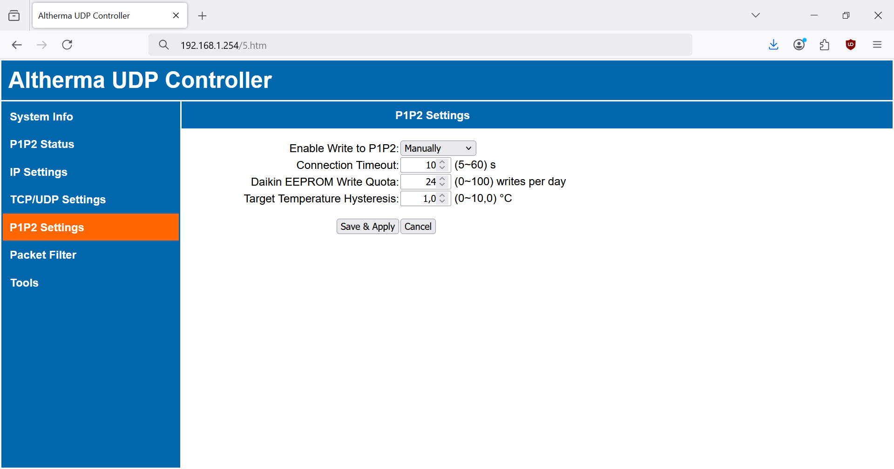
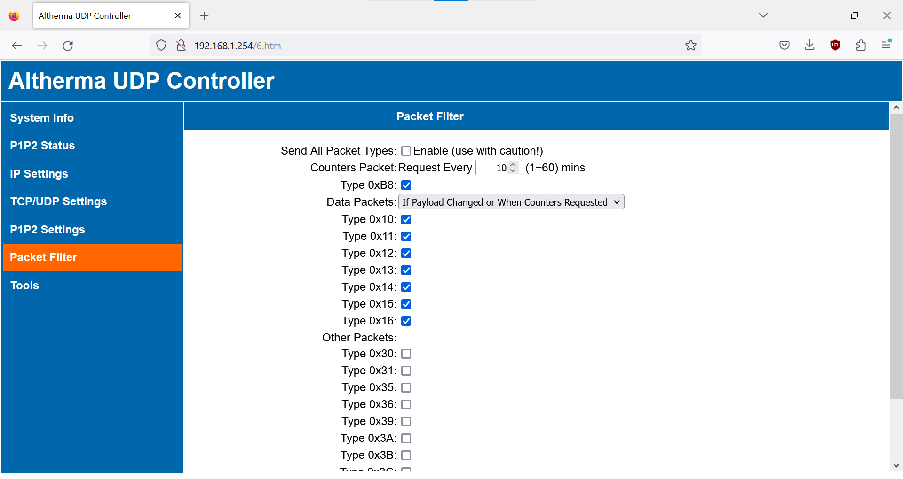
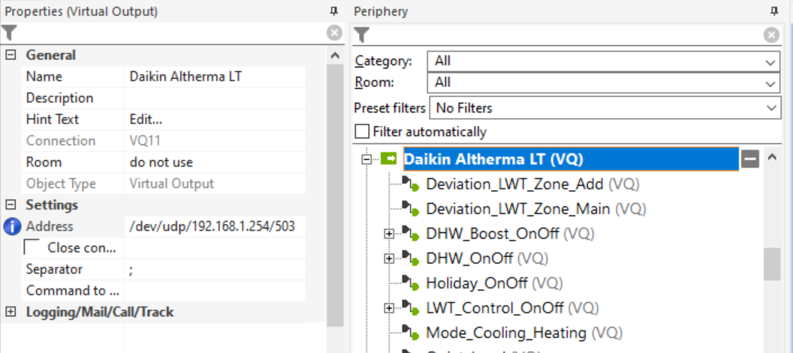

# Arduino Altherma UDP Controller

* [What is it good for?](#what-is-it-good-for)
* [Technical specifications](#technical-specifications)
* [Hardware](#hardware)
* [Firmware](#firmware)
* [Settings](#settings)
  - [System Info](#system-info)
  - [P1P2 Status](#p1p2-status)
  - [IP Settings](#ip-settings)
  - [TCP/UDP Settings](#tcpudp-settings)
  - [P1P2 Settings](#p1p2-settings)
  - [Packet Filter](#packet-filter)
  - [Tools](#tools)
* [Integration](#integration)
  - [Loxone](#loxone)
  - [Other systems](#other-systems)
* [Limitations and known issues](#limitations-and-known-issues)
* [Comparison with other solutions](#comparison-with-other-solutions)
* [Version history](#version-history)

# What is it good for?

Allows you to connect your Daikin Altherma heat pump (P1/P2 bus) to a home automation system (such as Loxone). This controller reads data from the P1/P2 bus on your Daikin Altherma and forwards them via ethernet UDP. You can also control your Daikin Altherma by sending commands via ethernet UDP.

The controller has a built-in web interface. You can use this web interface to configure the controller itself, monitor the status of the controller's connection to the P1/P2 bus and check error counters. All settings and P1/P2 statistics are stored in EEPROM. This program implements P1P2Serial library (https://github.com/Arnold-n/P1P2Serial).

# Technical specifications

* this controller is compatible with Daikin Altherma heat pumps (E-series), including:
  - Altherma Hybrid
  - Altherma
  - Altherma 3
* connects to Daikin Altherma via P1/P2 interface
* connects to home automation system via local ethernet
* communication protocol:
  - UDP (raw HEX data)
* diagnostics via built-in web interface:
  - send P1/P2 command directly via web interface
  - P1/P2 statistics, counters for packets read from and written to P1/P2, counters for errors (counters are saved to EEPROM every 6 hours)
  - rollover of counters is synchronized
  - content of the P1P2 Status page is updated in the background (fetch API), javascript alert is shown if connection is lost
* user settings:
  - can be changed via web interface (see screenshots bellow)
  - stored in EEPROM
  - retained during firmware upgrade (only in case of major version change, Arduino loads factory defaults)
  - all web interface inputs have proper validation
  - factory defaults for user settings can be specified in advanced_settings.h
  - settings marked \* are only available if ENABLE_DHCP is defined in the sketch
  - settings marked \*\* are only available if ENABLE_EXTRA_DIAG is defined in the sketch
* advanced settings:
  - can be changed in sketch (advanced_settings.h)
  - stored in flash memory

# Hardware
Get the hardware and connect together:

* **Arduino Uno**. Cheap clones are sufficient.
* **Ethernet shield with WIZnet chip (W5100, W5200 or W5500)**. The ubiquitous W5100 shield for Uno/Mega is sufficient. If available, I recommend W5500 Ethernet Shield. You can also use combo board MCU + ethernet (such as ATmega328 + W5500 board from Keyestudio). ATTENTION: Ethernet shields with ENC28J60 chip will not work !!!
* **Custom P1P2 Uno adapter**. You can [solder your own adapter](https://github.com/Arnold-n/P1P2Serial/tree/main/circuits#p1p2-adapter-as-arduino-uno-hat) or buy one from Arnold-n (his e-mail address can be found on line 3 of his library [P1P2Serial.cpp](https://github.com/Arnold-n/P1P2Serial/blob/main/P1P2Serial.cpp)).

Here is my HW setup (cheap Arduino Uno clone + W5500 Ethernet shield from Keyestudio + custom P1P2 Uno adapter):

# Firmware

You can either:
- **Download and flash my pre-compiled firmware** from "Releases".
- **Compile your own firmware**. Download this repository (all *.ino files) and open arduino-altherma-controller.ino in Arduino IDE. If you want, you can check advanced_settings.h for advanced settings (can only be changed in the sketch) and for default factory settings (can be later changed via web interface). Download all required libraries, compile and upload your program to Arduino. The program uses the following external libraries (all are available in Arduino IDE's "library manager"):
  - CircularBuffer (https://github.com/rlogiacco/CircularBuffer)
  - StreamLib (https://github.com/jandrassy/StreamLib)

Connect your Arduino to ethernet and use your web browser to access the web interface on default IP:  http://192.168.1.254

# Settings

This controller has a built-in webserver which allows you to configure the controller itself, check basic system info of the controller and the status of its connection to the P1/P2 bus. 

  - settings marked \* are only available if ENABLE_DHCP is defined in the sketch
  - settings marked \*\* are only available if ENABLE_EXTENDED_WEBUI is defined in the sketch

## System Info

**EEPROM Health**. Keeps track of EEPROM write cycles (this counter is persistent, never cleared during factory resets). Replace your Arduino once you reach 100 000 write cycles (with 6 hours EEPROM_INTERVAL you have more than 50 years lifespan).

**Ethernet Chip**. Wiznet chip on the ethernet shield.

**MAC Address**. First 3 bytes are fixed 90:A2:DA, remaining 3 bytes are random. You can also set manual MAC in IP Settings.

## P1P2 Status

**Daikin Indoor Unit**. Shows the name of your Altherma indoor unit.

**Daikin Outdoor Unit**.\*\* Shows the name of your Altherma outdoor unit.

**External Controllers**. Shows all external controller connected to the P1/P2 bus (incl. their addresses) and provides info whether additional controller is supported by your heat pump. These messages can show up:
* **No connection to the P1P2 bus**. No data packets were read from the P1/P2 bus. Check your connection to the P1/P2 bus.
* **This device is connected (read only)**. The controller is connected in read only mode. It does not write anything to the P1/P2 bus but it still passively monitors the P1/P2 bus and sends (most) data from the heat pump via UDP messages. If your **Enable Write to P1P2** setting is set to *Manually*, you can manually enable write mode (if your pump supports additional device on the P1/P2 bus). Read only mode has several limitations:
  - does not show Altherma model in **Daikin Unit**
  - can not periodically request, read (and send via UDP) Altherma counters
  - can not control Altherma by sending **Write Command** through the web interface
  - can not control Altherma by sending commands via UDP
* **This device is connected (address 0xF..)**. This Arduino device is connected to the P1/P2 bus for both reading and writing (sending commands). The controller can write to the P1/P2 bus only after it has been allocated an address by the heat pump (Arduino will accept any address in the 0xF0 ~ 0xFF range). If your **Enable Write to P1P2** setting is set to *Manually*, you can manually disable write mode (release the address) and downgrade the connection to read only.
* **Another device is connected (address 0xF..)**. Another device is connected to the P1/P2 bus using address 0xF.. This "another device" can be second Arduino device, commercial controller by Daikin or by third party (Daikin LAN adapter, Daikin Madoka, DCOM LT/MB, Zennio KLIC-DA KNX, Coolmaster, etc.).
* **Additional device can be connected (address 0xF..)**. Additional device can be connected to the P1/P2 bus. How many devices can be connected (ie. how many addresses are available for external devices) depends on the model of the heat pump. For example, Altherma LT supports only 1 device (address 0xF0), Altherma 3 support up to 3 devices (addresses 0xF0, 0xF1 and 0xFF).
* **Additional device not supported by the pump**. All available addresses have been allocated to external controllers. The heat pump (the main Daikin controller) does not support additional device on the P1/P2 bus.

**Date**. Displays internal date and time of the heat pump.

**Daikin EEPROM Writes**. Every time you send **Write Command** through the web interface or a command via UDP, settings of the main Daikin controller (= controller on your heat pump) change and new values are written to its internal EEPROM. **<ins>Your main Daikin controller's EEPROM has a limited number of writes, so keep an eye on this counter in order to prevent EEPROM wear! It is adviced to do max 7000 writes per year (19 writes/day on average)</ins>**.
* **Stats since ...**. Date and time since when **Daikin EEPROM Writes** are recorded. If you significantly change the date on the heat pump, reset the stats (so that **Average per Day** is calculated properly).
* **Total Commands**. Total number of writes made by this Arduino controller since the date and time recorded in **Stats since ...**.
* **Daily Average**. Daily average EEPROM writes, should be bellow 19. Calculated from internal date of the heat pump, so if you change the date in heat pump settings, it is recommended to reset the Daikin EEPROM Writes counter.
* **Yesterday**. Number of writes made yesterday, updated at midnight. Should not significantly exceed average writes per day.
* **Today**. Number of writes made today / out of daily **EEPROM Write Quota**. If you reach the quota and you really need more, you can temporarily (!) increase it in the **P1P2 Settings**

**Write Command**. You can send a P1/P2 write command directly from web interface, for testing or reverse-engineering P1/P2 write commands. The format of the write command send via web interface is identical to the command sent via UDP:
* **Packet Type**. The first byte is the packet type. Only supported packet types are listed in the drop-down menu.
* **Param**. Parameter number, two bytes **<ins>in little endian format</ins>**! For example, parameter number 03 is inserted as `03` `00`.
* **Value**. Parameter value, the number of bytes differs for various packet types. See PACKET_PARAM_VAL_SIZE in advanced settings for the correct number of bytes. Value is also **<ins>in little endian format</ins>**!

**P1P2 Packets**. Counters for packets read from the P1/P2 bus or written to the P1/P2 bus, counters for various read and write errors. If any of the counters rolls over the unsigned long maximum (4,294,967,295), all counters will reset to 0.
* **Bus Read OK**. Number of packets read from the P1/P2 bus, without errors. Not all of them are sent via UDP (see the **Packet Filter** settings). Packets are read from the P1/P2 bus (and sent via UDP) even if the controller is not connected to the P1/P2 bus.
* **Bus Write OK**. Number of packets written to the P1/P2 bus. Writing to the P1/P2 bus is only possible after the controller receives an address from the pump (from the main Daikin controller). Several types of packets are be written to the P1/P2 bus:
  - Regular responses to heat pump's polling of external controllers (keep alive).
  - Requests for the counters packets. If the **Enable Write to P1P2** setting is set to *Automatically*, requests for counter packets are sent even if the controller failed to receive an address (is in read only mode).
  - Write commands received via web interface or UDP. These packets are written to the P1/P2 bus and written in Daikin EEPROM.
* **EEPROM Write Quota Reached**. Daily EEPROM Write Quota (configured in **P1P2 Settings**) was reached. The command (received via UDP or from the web interface) was dropped.
* **Write Command Queue Full**. Internal queue (circular buffer) for commands is full. The command (received via UDP or from the web interface) was dropped.
* **Write Command Invalid**. Command received via UDP or from the web interface was invalid, it was dropped. Possible reasons:
  - Packet type (first byte) is not supported (PACKET_PARAM_VAL_SIZE in advanced settings is set to zero).
  - Incorrect packet length. Command should have 1 byte for type, 2 bytes for parameter number and the correct numer of bytes for the parameter value (see PACKET_PARAM_VAL_SIZE in advanced settings).
* **Parity Read Error**.
* **Too Long Read Error**. Packet received is longer than the read buffer.
* **Start Bit Write Error**. Start bit error during write.
* **Bus Collission Write Error**. Data read-back error or high bit half read-back error, most probably caused by bus collision.
* **Buffer Overrun Error**. Buffer overrun during read or read-back-verify.
* **CRC Error**. CRC error during read or read-back-verify.

**UDP Messages**.\*\*
* **Sent to UDP**. Counts packets (messages) read from the P1/P2 bus and sent via UDP. Not all packets read from the P1/P2 bus are sent via UDP (see the **Packet Filter** settings).
* **Received from UDP**. Counts all messages received via UDP from a valid remote IP.

## IP Settings

**MAC Address**.\*\* Change MAC address. "Randomize" button will generate new random MAC (first 3 bytes fixed 90:A2:DA, last 3 bytes will be random).

**Auto IP**.\* Once enabled, Arduino will receive IP, gateway, subnet and DNS from the DHCP server.

**Static IP**. Set new static IP address. Automatically redirect the web interface to the new IP.

**Submask**.

**Gateway**.

**DNS**.\*

## TCP/UDP Settings

**Remote IP**. IP address of your home automation system which listens for UDP messages and sends UDP commands.

**Send and Receive UDP**.
* **Only to/from Remote IP**. Only accept UDP messages from the **Remote IP**, send UDP messages directly (unicast) to the **Remote IP**.
* **To/From Any IP (Broadcast)**. Accept UDP messages from any IP, send UDP messages as UDP broadcast. UDP broadcast is faster than UDP unicast. **Remote IP** setting has no effect.

**UDP Port**. Local UDP port and remote UDP port.

**WebUI Port**. Change web UI port, automatically redirects the web interface to the new Web UI port.

## P1P2 Settings

**Enable Write to P1P2**.
* **Manually** (default). User can manually enable / disable writing to the P1/P2 bus (see the **P1P2 Status** page). After reboot or if connection is interrupted (see **Connection Timeout**), connection is downgraded to read only.
* **Automatically**. The controller tries to (re)enable writing to the P1/P2 bus after (re)start, or if connection is interrupted. Even if the controller fails to receive an address from the heat pump, it will write counter requests to the P1/P2 bus (address is not needed for sending counter requests). Use *Automatically* at your own risk and only after you have successfuly enabled write manually! **Check the P1P2 Status page for P1/P2 errors and monitor Daikin EEPROM Writes in order to minimize Daikin controller EEPROM wear!**

**EEPROM Write Quota**. Daily quota for writes to the EEPROM of the main Daikin controller. Every command sent via web interface (**Write Command** on **P1P2 Status** page) or via UDP = write cycle to the Daikin EEPROM. If the daily quota is reached, new commands are dropped. The quota resets at midnight.

**Connection Timeout**. Timeout for reading data packets and for enabling writing to the P1/P2 bus.
* If no data packet is received after timeout, **No connection to the P1P2 bus** message is displayed in the **P1P2 Status** page.
* In **Manual Connect** mode, user initiated attempt to enable writing to the P1/P2 bus (to the main Daikin controller) fails if the controller does not receive an address within the **Connection Timeout**.
* During operation, connection can be downgraded to read only if the controller loses its address for a period longer than the **Connection Timeout** (for example if the address is allocated by the heat pump to another external controller).

**Target Temperature Hysteresis**. Hysteresis for writing target temperature or target setpoint commands (packet type 0x36) in 1/10 °C. Applies for write commands received via UDP. The purpose is to minimize Daikin controller EEPROM wear.

## Packet Filter

The **Packet Filter** page lists all packet types observed on the P1/P2 bus. Some of them are exchanged between the heat pump and the main Daikin controller, others are exchanged between our controller (or other external controllers) and the main Daikin controller. If you do not see any packet types, wait few seconds. If a new packet type is detected, it will be automatically added to the list. **Packet types enabled on this page are forwarded via UDP**. By default, only Counter Packet (0xB8) and Data Packets (usually 0x10 - 0x16) are sent via UDP. Enable additional packet types if you want to test or reverse-engineer the P1/P2 protocol.

**Send All Packet Types**. All packets read from the P1/P2 bus are sent via UDP (including packet types which were not yet observed). There is a lot of communication going on on the P1/P2 bus, so use with caution!

**Counters Packet**. Counter packet is periodically requested by the controller (only works if the controller is connected to the P1/P2 bus). Set the period for the counter packet requests.

**Data Packets**.
* **Always Send (~770ms cycle)**. Data packets are always sent via UDP, whenever they are read from the P1/P2 bus. Data packets are regularly exchanged between the heat pump and the main Daikin controller every 770ms.
* **If Payload Changed or When Counters Requested**. The controller stores data packet payloads in its RAM. Data packets are sent via UDP:
  - if their payload changed
  - or when the counters packet is requested (see the counters packet request period)
* **Only If Payload Changed**. Data packets are sent via UDP only if their payload changed.

## Tools

**Load Default Settings**. Loads default settings (see DEFAULT_CONFIG in advanced settings). MAC address is retained.

**Reboot**.

# Integration

This controller is mainly intended for the integration with Loxone home automation system.

## Loxone
https://user-images.githubusercontent.com/6001151/232344216-52fd6a9e-4cc3-4d51-8f66-87266d960757.mp4
### 1. Wiring

It is advised to connect/disconnect devices to the P1/P2 bus only if the power of all connected devices is switched off.

### 2. Controller Settings

The controller can passively read (monitor) most data from the P1/P2 bus while being in a **Disconnected** state. If you also want to write to the bus and control your heat pump, you can (at your own risk!) connect the controller to the P1/P2 bus (to the main Daikin controller). Connect the controller manually, if no errors show up on the P1P2 Status page, enable **Auto Connect**.

Optionally, set the **Remote IP** (= Loxone Miniserver IP) and enable **Only to/from Remote IP**. See [Remote IP Settings on the W5500 Chip](#remote-ip-settings-on-the-w5500-chip).

### 3. Virtual UDP Input

Download the Loxone template **[VIU_Daikin Altherma.xml](https://github.com/budulinek/arduino-altherma-controller/blob/main/VIU_Daikin%20Altherma.xml)**. Open Loxone Config and in the periphery tree mark `Virtual Inputs`, then go to UDP Device Templates > Import Template ... in the menu bar:

Find the template you have downloaded and import the template. You should see Daikin Altherma with a number of `Virtual UDP Input Commands`. Change the Sender IP address (= IP of your Arduino controller) or UDP port if needed.

Just drag and drop individual inputs into your Loxone plan and you are ready to go. There are only two challenges:
* LWT deviations `Deviation_LWT_<Zone>_<Heating/Cooling>` are split into two inputs carrying positive values `_Pos` and negative values `_Neg`.
* There are compound inputs containing multiple digital inputs in one byte. Names of these compound inputs end with `_B`. You need to connect these compound inputs to a `Binary Decoder` block and decode individual digital inputs according to the provided hint. Here is an example of `Valves_B` compound input:

### 4. Virtual Output

Virtual Output will only work if the Arduino controller is fully connected to the P1/P2 bus (can write to the bus). Moreover, writeable command are device-specific. The Virtual Output Commands provided in the template may (with no guarantee) work only with **Daikin Altherma LT (EHVH(H/X/Z))** heat pumps. **<ins>Use at your own risk!!!</ins>**

Download the Loxone template **[VO_Daikin Altherma LT.xml](https://github.com/budulinek/arduino-altherma-controller/blob/main/VO_Daikin%20Altherma%20LT.xml)**. Open Loxone Config and in the periphery tree mark `Virtual Outputs`, then go to Device Templates > Import Template ... in the menu bar. Find the template you have downloaded and import the template. You should see Daikin Altherma LT with a number of `Virtual Output Commands`. Change the IP address or UDP port if needed:

There are 3 types of outputs available:

* Analog outputs for target temperatures, setpoints etc. As expected, these outputs accept temperature in °C (float).
* Digital outputs have `_OnOff` in their name. As expected: 0 = Off, 1 = On.
* Discreet analog outputs for various operational modes. These outputs accept discreet integer values - see the provided hints. Here is an example of Heating/Cooling operational mode:

If you want to control your heat pump through Loxone App (just like I did in the short video above) or Loxone Web Interface, use the `EIB push-button` block. It has the same functionality as a normal push-button but in addition has the State (S) input which can forward the status of a heat pump settings without triggering an action on the output. As a result, you can have a smooth two-directional communication between the main Daikin controller and the Loxone App. Here you have a solution for the DHW On/Off push-button and the DHW Boost push button. Please note that the DHW_OnOff_B input is a compound input which needs to be decoded with `Binary Decoder`:

### 5. Digital Outputs (Relays)

By default, the main Daikin controller (the user interface mounted at the indoor unit) acts as a thermostat. It has a temperature sensor and can control the heat pump by comparing the actual room temperature with target room temperature. This is not very practical solution if the main Daikin controller is located at the unit which sits somewhere in a separate boiler room.

Fortunately, 1) Daikin Altherma allows you to connect an external thermostat and 2) Loxone Miniserver can act as an external thermostat.

**Wiring**. External thermostat is an external 230V relay operated by a temperature sensor (+ some scheduling logic). It controls the heat pump by opening and closing a **<ins>230V circuit!</ins>** **<ins>Danger of death!</ins>** Always unplug your heat pump from the mains before connecting wires and consult your heat pump's Installation manual in order to locate the correct wiring terminal. **<ins>Proceed at your own risk!</ins>**  If you know what you are doing, connect the correct wiring terminal of your heat pump (on my Altherma I have used the X2M wiring terminal) to Loxone Miniserver relays. You can use separate relays for heating and cooling and separate relays for main LWT zone and additional LWT zone. Therefore, up to 4 external relays can be used depending on the complexity of your heating/cooling system.

**Heat Pump Configuration**. Enable external thermostat on your heat pump. Consult your installation manual. In my case I have the settings here: `Installer settings > System layout > Standard > [A.2.1.7] Unit control method > Ext RT control`. If you want to use separate relays for heating and cooling, check also `Installer settings > System layout > Options > [A.2.2.4] Contact type main > H/C request`.

**Loxone Config**. You can now connect your `Digital Outputs` (relays) directly to the `HVAC Controller` block:

It is quite simple. I have a `HVAC Controller` block which serves as a heating and cooling source for 7 `Intelligent Room Controllers` (see the "7 Objects Assigned" note at the bottom of the HVAC block). The HVAC block needs to know the outdoor temperature, so I have connected the `Temperature_Outside_Stabilized` measured by the heat pump. Relay `Ext_Therm_Main_Heating` triggers heating on the main LWT zone (underfloor heating), relay `Ext_Therm_Add_Cooling` triggers cooling on the additional LWT zone (ceiling cooling panels). `Ext_Therm_Main_Cooling` is not connected because I do not use floor for cooling.

### 6. Application Recommendations

**Use relays for heating/cooling requests**. Your Loxone automation system can now control the Altherma heat pump through 2 sets of outputs: Virtual Output Commands (UDP) and Digital Outputs (Relays). Each of them is doing a different thing, the two do not replace but complement each other: 
* **Virtual Output Commands** are sent (via UDP) to the Arduino controller and then (via P1/P2 bus) to the main Daikin controller at your indoor unit. These commands allow you to remotely change user settings (Quiet Mode, Schedules), target temperatures (DHW, LWT), turn the DHW on/off, etc. **<ins>Whenever you use Virtual Output Commands (UDP), new settings are stored in the main Daikin controller, wearing its EEPROM!</ins>** Use these outputs sparingly. For example, the `LWT_Control_OnOff` command completely shuts down heating (though DHW still works). Valves are closed and the heat pump ignores any heating/cooling requests from the internal thermostat (main Daikin controller) or from the external thermostat (Loxone relays). Use this output only if you want to stop the heat pump for longer periods of time (such as holidays).
* **Digital Outputs** allow you to send heating / cooling requests by closing Loxone Miniserver relays. These relays are connected directly to the heat pump's wiring terminals, not to the main Daikin controller. No new data (settings) are stored in the main Daikin controller's EEPROM. You do wear out your Loxone relay a bit, but relays are easier (and cheaper) to replace than the internal EEPROM of your Daikin controller. Use relays for automated heating / cooling requests, they are meant to be used this way. For example (and in contrast to the LWT_Control_OnOff command mentioned above), the `Ext_Therm_Main_Heating` output only sends a request for heating. When the relay is closed (DO = 1), the heat pump knows there is a demand for heating, and starts compressor in order to maintain the leaving water temperature at a certain level. When the relay is open (DO = 0), compressor stops, no heat is produced but the heat pump remains in a stand-by mode, waiting for new heating request.

**Adjust the heating curve**. Daikin Altherma heat pumps have a built-in heating curve (weather-dependent curve, equithermic curve). Heating curve means that the leaving water temperature (LWT) depends on weather (outdoor temperature).  Interestingly, Loxone also has a heating curve, integrated in the `Intelligent Temperature Controller` block. Here are your choices:

* **Altherma heating curve**. Altherma heating curve (weather-dependent curve) can be enabled/disabled in installer settings. Consult your installation manual, in my case it is here: `Installer settings > Space operation > LWT settings > Main > [A.3.1.1.1] LWT setpoint mode`. By default, heating curve should be enabled (`Weather dep.`). Users can configure parameters of the heating curve (`User settings > Set weather dependent > Main > Set weather-dependent heating`). In this example, Altherma will use outdoor temperature to calculate the LWT, Loxone will only send heating requests through `Ext_Therm_Main_Heating` relay:

* **Loxone heating curve**. Loxone heating curve is more advanced than Altherma heating curve, because Loxone uses more variables to calculate the LWT. Not just the outdoor temperature, but also the target room temperature, the difference between target and actual room temperatures, room heating phase / cooling phase. Moreover, Loxone can also adjust the target room temp (thus the requested LWT) based on schedule or presence of people. So, go ahead and completely disable your Altherma's heating curve (set the `LWT setpoint mode` to `Absolute`) and use the Loxone block `Intelligent Temperature Controller` (AQf - Flow Target Temperature) to calculate the LWT. Loxone will send heating requests through `Ext_Therm_Main_Heating` relay and requested leaving water temperature through `Target_Setpoint_LWT_Zone_Main` virtual UDP command. This is the most efficient way of controling your heat pump. The problem is that target LWT values calculated by Loxone change far too often (because outdoor temperature fluctuates throughout the day). Hysteresis setting in Arduino helps you reduce the frequency of LWT values sent to the heat pump, but the number of EEPROM writes will (probably) still exceed the limit (19 writes per day). You can give it a try but I do not recommend this choice.

* **Altherma heating curve + adjustments by Loxone**. The `Intelligent Temperature Controller` block can also output AQi - Flow Temperature Increase/Decrease. This increase/decrease is caused by the room temperature difference (see parameter G - Gain) and the target room temperature increase during heating phase (see parameter I - Target temperature increase). In other words, AQi is Loxone's adjustment to the weather-dependent target LWT. We can sent it to the heat pump through the `Deviation_LWT_Zone_Main` virtual UDP command. This is a compromise solution. We will let Altherma calculate the weather-dependent LWT (from the outdoor temperature) and Loxone will calculate the LWT adjustment (from the difference between target and actual room temperature). Since AQi does not change that often, we will have less EEPROM writes. You can try this choice, but:
  - Set the parameter I - Target temperature increase to zero. Daikin user manual explicitly discourages users from increasing/decreasing the desired room temperature to speed up space heating/cooling. Use only the parameter G - Gain.
  - Check the number of Daikin EEPROM Writes in the Arduino controller web interface. Make sure that average writes per day (and yesterday writes) remain bellow the limit (19 writes per day).

## Other systems

#### Home Assistant

Arduino Altherma UDP controller is not suitable for Home Assistant. As far as I know, it is difficult to parse hex UDP messages in HA. Check the table bellow and use another solution (or Node-RED as an intermediary).

#### Node-RED

Import and configure the **[node-red-contrib-buffer-parser](https://flows.nodered.org/node/node-red-contrib-buffer-parser)** package. See [Payload-data-read.md](Payload-data-read.md) how to parse UDP messages (read data from the heat pump). See [Payload-data-write.md](Payload-data-write.md) how to make UDP commands (write to the heat pump).

You can use Node RED as:
* a rudimentary automation system on its own
* an intermediary between the Arduino controller and other home automation system
* an intermediary between the Arduino controller and a time series database and visualisation tool (InfluxDB + Grafana)

# Limitations and known issues

## Portability

The code was tested on Arduino Uno, ethernet chips W5100 and W5500. It may work on other platforms, but:

* The random number generator (for random MAC) is seeded through watch dog timer interrupt - this will work only on Arduino (credits to https://sites.google.com/site/astudyofentropy/project-definition/timer-jitter-entropy-sources/entropy-library/arduino-random-seed)
* The restart function will also work only on Arduino.

## Remote IP settings on the W5500 Chip

The Ethernet.setRetransmissionCount() and Ethernet.setRetransmissionTimeout() commands do not work on W5500 chips because of a bug in the Ethernet.h library (see [this issue](https://github.com/arduino-libraries/Ethernet/issues/140)). As a result, Arduino fails to read data from the P1/P2 bus (read errors, CRC errors) if certain conditions are met:
* Ethernet shield with the W5500 chip is used.
* Send and Receive UDP setting is set to **Only to/from Remote IP**.
* Device with the remote IP does not exist on your local LAN.

In this situation (UDP unicast) the W5500 chip checks whether the remote IP exists via ARP request. While the Ethernet.h waits for the ARP response, new P1/P2 packet arrives and is not properly processed which leads to P1/P2 read errors. The solution is simple. If you have a shield with the W5500 chip, set the Send and Receive UDP setting to **To/From Any IP (Broadcast)**.

## Ethernet sockets

The number of used sockets is determined (by the Ethernet.h library) based on microcontroller RAM. Therefore, even if you use W5500 (which has 8 sockets available) on Arduino Nano, only 4 sockets will be used due to limited RAM on Nano.

## Memory

Not everything could fit into the limited flash memory of Arduino Nano / Uno. If you have a microcontroller with more memory (such as Mega), you can enable extra settings in the main sketch by defining ENABLE_DHCP and/or ENABLE_EXTRA_DIAG in advanced settings.

# Comparison with other solutions

As of April 2023:

| **Project** | **[budulinek/ arduino-altherma-controller](https://github.com/budulinek/arduino-altherma-controller)** | **[Arnold-n/ P1P2Serial](https://github.com/Arnold-n/P1P2Serial)** | **[raomin/ ESPAltherma](https://github.com/raomin/ESPAltherma)** | **[tadasdanielius/ daikin_altherma](https://github.com/tadasdanielius/daikin_altherma)** | **[speleolontra/ daikin_residential_altherma](https://github.com/speleolontra/daikin_residential_altherma)** ||
|------------------------------------|------------------------------------------------------------------------------------|----------------------------------------------------------|-------------------------------------------------------------------------------|------------------------------------------------------------------------------|------------------------------------------------------------------------------|-------------------------------------------|
| **Hardware** | • Arduino Uno • Ethernet Shield • Custom P1P2 Uno adapter | • Custom all-in-one board | • M5StickC (or any ESP32/ESP8266 board)  • external relay (optional) | • Daikin LAN adapter (BRP069A62/ BRP069A61 with OLD firmware) | • Daikin LAN adapter (BRP069A62/ BRP069A61 with NEW firmware) | • Daikin WLAN adapter (BRP069A78) |
| **Programable MCUs** | 1 ATmega328P | 2 ATmega328P + ESP8266 | 1 ESP32/8266 | --- | --- ||
| **Connection to Daikin Altherma**  | P1/P2 bus | P1/P2 bus | X10A serial port | P1/P2 bus | P1/P2 bus | dedicated slot |
| **Interface** | • Ethernet | • WiFi • Ethernet (optional) | • WiFi | • Ethernet | • Ethernet | • WiFi |
| **Local LAN or Cloud** | Local | Local | Local | Local | Cloud ||
| **Controller configuration** | • web interface • sketch | • console • sketch | • sketch | • web interface | • web interface ||
| **OTA upgrades** | No | Yes | Yes | Yes | Yes ||
| **Read data from Daikin Altherma** | Yes | Yes | Yes | Limited | Limited ||
| **Control Daikin Altherma** | Yes | Yes | Limited | Yes | Yes ||
| **Communication protocol** | UDP | MQTT | MQTT | Websockets | Websockets ||
| **Data format** | HEX | JSON | JSON | JSON | JSON ||
| **Integration with** | • Loxone • other systems (via UDP-HEX) | • Home Assistant • other systems (via MQTT-JSON) | • Home Assistant • other systems (via MQTT-JSON) | • Home Assistant | • Home Assistant ||

## Version history

For version history see:

https://github.com/budulinek/arduino-altherma-controller/blob/main/arduino-altherma-controller/arduino-altherma-controller.ino#L3

